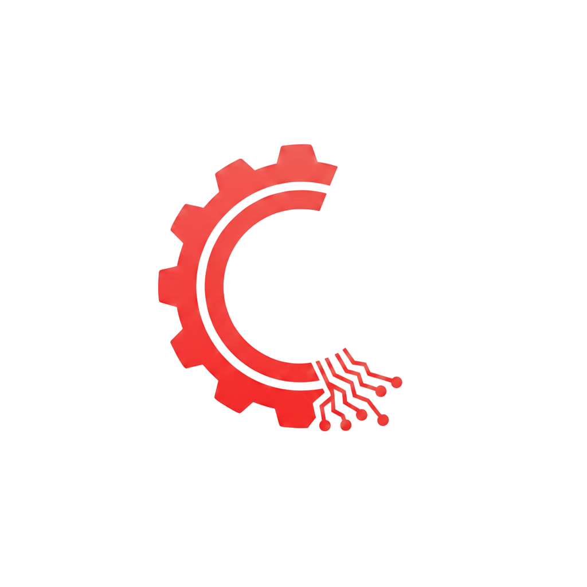

<h1>Pagandahin ko for your referrence para magaya mo hahahahhha</h1>

<h1 align="center">Hello I'm currently building CrimsoTech, an AI powered Used Electronics E-Commerce!</h1>

  

<h1 align="center">Hi there, I'm Mar 👋</h1>
<h3 align="center">A passionate Computer Science student from the Philippines 🇵🇭</h3>

---

### 🎓 Education
**Bachelor of Science in Computer Science (3rd Year)**  
*Western Mindanao State University*  
📍 Zamboanga City, Philippines

---

### 🛠️ Tech Stack

#### **Backend Development**

  
  
  
  
  
  
  

- **Go** – Language · REST APIs, microservices
- **Gin** – Framework · Lightweight HTTP web framework for Go
- **Python** – Language · Scripting, backend logic, automation
- **Django** – Framework · Full-featured MVC web framework for Python
- **Django REST Framework** – Library · Powerful toolkit for building REST APIs with Django
- **PHP** – Language · Server-side scripting
- **Laravel** – Framework · Full-featured MVC framework for PHP

#### **Databases**

  
  
  

- **PostgreSQL** – Relational database for production apps
- **MySQL** – Relational database for structured data
- **GORM** – ORM · Go ORM for database interactions

#### **Frontend Development**

  
  
  
  
  
  
  

- **HTML5** – Language · Markup and structure
- **CSS3** – Language · Styling and layout
- **JavaScript** – Language · Core web interactivity
- **TypeScript** – Language · Typed superset of JavaScript
- **React** – Library · Component-based UI development
- **React Router** – Framework · SPA routing and data loading
- **Tailwind CSS** – Framework · Utility-first CSS styling

#### **DevOps**

  
  

- **GitHub Actions** – Automated workflows, testing, deployment pipelines
- **Docker** – Containerization, environment consistency

#### **🛠️ Tools & Environments**

  
  
  
  
  

- **macOS** – Daily driver for development
- **VS Code** – Primary code editor with extensions
- **Postman** – API testing and debugging
- **Git & GitHub** – Version control and CI/CD workflows

---

### 📊 GitHub Stats

  

---

### 📫 Connect with Me
- 📧 Email: [marmanonog07@gmail.com](mailto:marmanonog07@gmail.com)
- 💼 LinkedIn: [Marlo Manon-og](https://www.linkedin.com/in/marlo-manon-og-a88745392/)

---

### 🗣️ Techstack Summary

<table align="center">
  <tr>
    <th>Backend</th>
    <th>Frontend</th>
    <th>Databases</th>
  </tr>
  <tr>
    <td align="center">
      
      
      
    </td>
    <td align="center">
      
      
      
    </td>
    <td align="center">
      
      
      
    </td>
  </tr>
</table>

